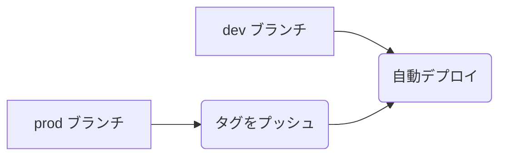

# time-capsule

time-capsuleは、時間を超えてメッセージを保存するためのリポジトリです。

## 使い方

```shell
brew bundle
asdf plugin-add nodejs
asdf install
npm install -g pnpm
```

<details>
<summary>初回セットアップ</summary>

## Next.jsのプロジェクトを作成

```shell
$> pnpm dlx create-next-app frontend

pnpm dlx create-next-app frontend

Packages: +1
+
Progress: resolved 1, reused 1, downloaded 0, added 1, done
✔ Would you like to use TypeScript? … No / Yes
✔ Would you like to use ESLint? … No / Yes
✔ Would you like to use Tailwind CSS? … No / Yes
✔ Would you like to use `src/` directory? … No / Yes
✔ Would you like to use App Router? (recommended) … No / Yes
✔ Would you like to customize the default import alias (@/*)? … No / Yes
✔ What import alias would you like configured? … @/*
Creating a new Next.js app in /home/tqer39/workspace/time-capsule/frontend.

Using pnpm.

Initializing project with template: app-tw


Installing dependencies:
- react
- react-dom
- next

Installing devDependencies:
- typescript
- @types/node
- @types/react
- @types/react-dom
- autoprefixer
- postcss
- tailwindcss
- eslint
- eslint-config-next

Packages: +356
+++++++++++++++++++++++++++++++++++++++++++++++++++++++++++++++++++++++++++++++++++++++++++++++++++++++++++++++++++++++++++++++++++++++++++++++++++++++++
Progress: resolved 364, reused 355, downloaded 1, added 356, done

dependencies:
+ next 14.1.4
+ react 18.2.0
+ react-dom 18.2.0

devDependencies:
+ @types/node 20.11.30
+ @types/react 18.2.70
+ @types/react-dom 18.2.22
+ autoprefixer 10.4.19
+ eslint 8.57.0
+ eslint-config-next 14.1.4
+ postcss 8.4.38
+ tailwindcss 3.4.1
+ typescript 5.4.3

Done in 4s
Success! Created frontend at /home/tqer39/workspace/time-capsule/frontend
```

</details>

## デプロイ

### dev ブランチのデプロイ

dev ブランチにマージすると自動的にデプロイされます。

### prod ブランチのデプロイ

prod ブランチにタグをプッシュすると自動的にデプロイされます。



## pre-commit

```shell
pre-commit install --install-hooks
pre-commit run -a
```
